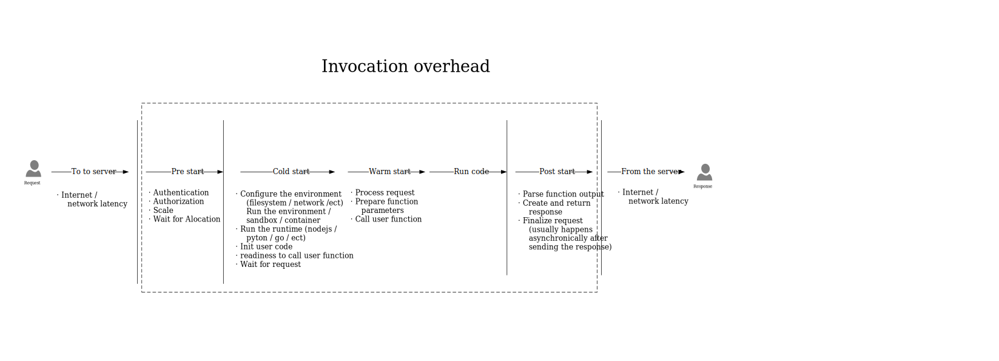
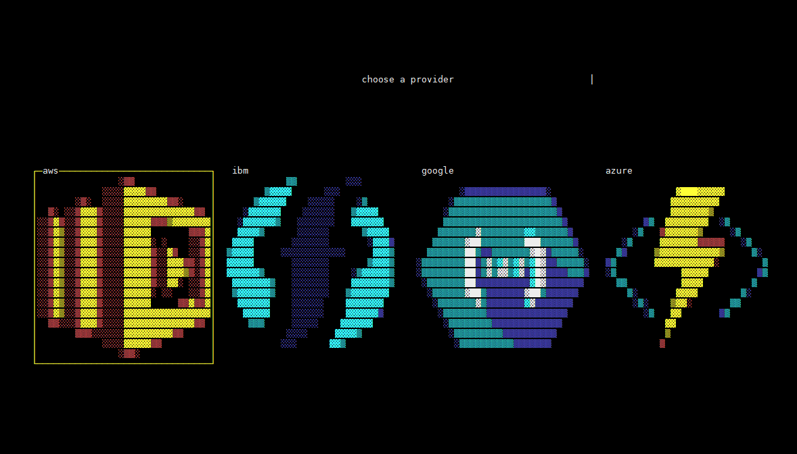

<h1><p align="center"></p></h1>

- [Purpose](#purpose)
- [Motivation](#motivation)
- [Where is Nuweba?](#where-is-nuweba-)
- [How to accurately test invocation overhead](#how-to-accurately-test-invocation-overhead)
- [Cold start, Warm start and Container reuse](#cold-start--warm-start-and-container-reuse)
- [Run Requirements](#run-requirements)
  * [Install Requirements](#install-requirements)
- [Run](#run)
  * [Terminal UI](#terminal-ui)
  * [CLI](#cli)
- [Project structure](#project-structure)
- [Add a new test](#add-a-new-test)
  * [Full Test:](#full-test-)
- [Add a new test stack to the arsenal](#add-a-new-test-stack-to-the-arsenal)
- [Add a new stack](#add-a-new-stack)
- [Add a new provider](#add-a-new-provider)

#### Purpose
This is the framework behind https://faastest.com/.
FaaSbenchmark is a framework to run and add generic tests to accurately benchmark FaaS providers.
#### Motivation
In order to reliably test our own FaaS platform (Nuweba) and compare it to other managed FaaS solutions, we created this framework.
With the growing popularity of FaaS platforms, we saw many new blogs and tools attempting to deal with FaaS benchmarking, each from their own perspective.
As active members in the serverless community, we decided to offer an accessible and pluggable solution by open sourcing this framework and inviting the community to participate in our efforts to add new tests cases for the various FaaS providers.
The results will be published on a regular basis on FaaStest.com, and the source for the tests will be available in this repo.  
If you feel that the tests are inaccurate or unreliable, please contact us as soon as possible so we can address it.
#### Where is Nuweba?
At the moment Nuweba's benchmark sources and results will not be shown here.  
Our core values include reliablity and transparency - since we don't currently offer a self service solution, other users can't corroborate our results.
#### How to accurately test invocation overhead
There is a lot of confusion about FaaS terminology, in particular "cold start".  
It's important to clarify the terminology, and standardize the way we benchmark FaaS providers.

Invocation overhead = The time it took to call the user function and *return the response.   
*in async functions response time is not always relevant.  
The illustration above depicts the full flow of a generic invocation.  
As you can see, there is a lot more going on than just cold start.  
It is important to realize that as FaaS platform users - it is very hard if not impossible to accurately separate cold start / warm start overheads without access to the platform's internals.
The benchmark code will run as close as possible to the actual platform servers (for example: aws ec2 for lambda) to minimize the network latency.
The test code will attempt to measure the actual duration inside the user function.  
* we consider the load time of user code as part of the cold start.
In simple terms, the full invocation overhead will be calculated as such:  
```
Invocation overhead = First Byte Response time - Request Sent time - Function duration
```
Note that to accurately calculate the invocation overhead we take the latest possible "Request Sent Time" by eliminating other time consuming operations.
These operations include but are not limited to:  
- dns resolve  
- tcp handshake  
- tls handshake  

In other scenarios for example, other FaaS providers trigger to invoke a function can be the UDP DNS packet, or the second GET HTTP request.

To generate a concurrent load a sleep function will be used, it has minimal overhead and we can assume it will stay alive while other incoming requests will trigger new functions.

The benchmarks results will show the invocation overhead as described above.  
#### Cold start, Warm start and Container reuse
When referring to warm start, the common assumption is that the same container / sandbox is ready to receive a new connection, but it's important to explain our view of the terminologies and highlight the differences.
- Container reuse - invoking a function by using the same environment / container / sandbox for more than one invocation, it can be full reuse or partial reuse (same storage, same process, reloaded user code / same storage, restart the runtime process / etc)
- Warm start - invoking a function using a warm container with a prebaked unused sandbox - resources from previous invocations are not recycled.
- Cold start - invoking a function when no container / sandbox is ready to receive the request. A new container must be created and the runtime and user code loaded.
cold start latency is mostly an internal metric, from the outside the cold start is only part of the total overhead that can affect the end-user experience. in some scenarios we can encounter a portion of the full cold start, think about scale prediction and statistical algorithms

A FaaS platform might support some or all of the above invocation types.  
Depending on the load pattern, we might encounter different ratios of invocation types.
For example, consider a simple FaaS platform which keeps a container up for a minute after invocation is finished.  
When benchmarking this provider, we might encounter a mix of warm and cold starts, with the ratio depending on the load pattern we are testing.  
In realty, most FaaS platforms probably use prediction algorithms and complex heuristics to optimize their invocation overheads.  
Optimizations often include partial/full container reuse, and in many scenarios the ratio of cold starts we encounter is small.

#### Run Requirements
The tests should be run as close as possible to the FaaS provider.
Each provider New() function will enforce you to use a VM inside the FaaS provider. (AWS EC2 for exemple)
##### Install Requirements
- go > 1.10
- serverless framework
- configure FaaS provider credentials (to be used by sls)

#### Run
##### Terminal UI
```sh
go run tui.go
```
<h1><p align="center"></p></h1>
<h1><p align="center"></p></h1>

##### CLI
```sh
go run main.go
```
```sh
$ FaaSbenchmark
Usage:
  FaaSbenchmark [command]

Available Commands:
  help        Help about any command
  list        list the providers or tests
  run         run a specific test
```

```sh
$ FaaSbenchmark list
Usage:
  FaaSbenchmark list [COMMAND] [flags]
  FaaSbenchmark list [command]

Available Commands:
  providers   show all the providers
  tests       show all the test id's
```

```sh
$ FaaSbenchmark run
Usage:
  FaaSbenchmark run [provider] [test id] [flags]
  FaaSbenchmark run [command]

Available Commands:
  aws         aws lambda functions

Flags:
  -r, --resultPath string   directory to write the results, default is cwd
```


#### Project structure

```sh

|   main.go
|   tui.go
|   
+---arsenal
|   \---cold start
|       |   description.txt
|       |   
|       \---aws
|           |   serverless.yml 
|           \---nodejs
|               |   .gitignore
|               |   .npmignore
|               |   handler.js
|                       
|   \---....
+---cmd
|       list.go
|       root.go
|       run.go
|       
+---config
|       function.go
|       global.go
|       http.go
|       stacks.go
|       test.go
|       
+---provider
|   |   provider.go
|   |   
|   \---aws
|           filter.go
|           function.go
|           provider.go
|           stack.go
|           
+---report
|   |   function.go
|   |   request.go
|   |   test.go
|   |   top.go
|   |   
|   +---generate
|   |   \---httpbench
|   |           preset.go
|   |           request.go
|   |           
|   +---multi
|   |       function.go
|   |       request.go
|   |       test.go
|   |       top.go
|   |       
|   \---output
|       +---file
|       |       function.go
|       |       request.go
|       |       test.go
|       |       top.go
|       |       
|       +---graph
|       |       function.go
|       |       request.go
|       |       test.go
|       |       top.go
|       |       
|       \---stdio
|               function.go
|               request.go
|               test.go
|               top.go
|               
+---stack
|   |   stack.go
|   |   
|   \---sls
|           function.go
|           stack.go
|           
+---testsuite
|   |   tests.go
|   |   
|   \---tests
|           ....
|           coldstart.go
|           testsuites.go
|           
\---tui
    |   graph.go
    |   
    \---assets
        |   amazon.png
        |   ....
```


#### Add a new test
1. Create a new go file under testsuite/tests

```
    ./testsuite/
            tests/
				name.go
```

2. Declare a test function
the function only receive one parameter, the config.Test
```go
func coldStart(test *config.Test) 
```
3. Create the function method test config (currently only Http config)
```go
	httpConfig := &config.Http{
		SleepTime:        sleep,
		Hook:             test.Config.Provider.HttpInvocationTriggerStage(),
		QueryParams:      &qParams,
		Headers:          &headers,
		Duration:         0,
		RequestDelay:     20 * time.Millisecond,
		ConcurrencyLimit: 3,
		Body:             &body,
	}
```
hook can be one of the folowing:


	GetConn
	DNSStart
	DNSDone
	ConnectStart
	ConnectDone
	TLSHandshakeStart
	TLSHandshakeDone
	GotConn
	WroteHeaders
	WroteRequest
	Got100Continue
	GotFirstResponseByte
	Wait100Continue

HttpInvocationTriggerStage is present in each provider, and will indicate for an http/s request the stage in which the actual invocation will happen (in https requests, generally, after the tls handshake is done and the headers where sent).
for more information read about httpbench funcuntly and presets.

4. Iterate over the stack's functions
```go
for _, function := range test.Stack.ListFunctions()
```
5. Create the function config
```go
		hfConf, err := test.NewFunction(httpConfig, function)
		if err != nil {
			continue
		}
```
6. Create the request
```go
		newReq := test.Config.Provider.NewFunctionRequest(hfConf.Function.Name(), hfConf.HttpConfig.QueryParams, hfConf.HttpConfig.Headers, hfConf.HttpConfig.Body)
```
7. init the httpbench trace
```go
trace := httpbench.New(newReq, hfConf.HttpConfig.Hook)
```
8. listen for http results with a specific result filter
```go
		wg.Add(1)
		go func() {
			defer wg.Done()
			httpbenchReport.ReportRequestResults(hfConf, trace.ResultCh, test.Config.Provider.HttpInvocationLatency)
		}()
```
9. run the benchmark (currently only http benchmark)
```go
requestsResult := trace.ConcurrentRequestsSyncedOnce(hfConf.HttpConfig.ConcurrencyLimit, hfConf.HttpConfig.RequestDelay)
```
10. report the results
```go
httpbenchReport.ReportFunctionResults(hfConf, requestsResult)
```
11. add an init function to register the test

	11.1. specify the required stack (use existing one or see add a new stack)
	
	11.2. give an informative description
 ```go
func init() {
	Tests.Register(Test{Id: "ColdStart", Fn: coldStart, RequiredStack: "coldstart", Description: "Test cold start"})
}
```

##### Full Test:

```go
#coldstart.go

func init() {
	Tests.Register(Test{Id: "ColdStart", Fn: coldStart, RequiredStack: "coldstart", Description: "Test cold start"})
}

func coldStart(test *config.Test) {
	sleep := 2000 * time.Millisecond
	qParams := sleepQueryParam(sleep)
	headers := http.Header{}
	body := []byte("")

	httpConfig := &config.Http{
		SleepTime:        sleep,
		Hook:             test.Config.Provider.HttpInvocationTriggerStage(),
		QueryParams:      &qParams,
		Headers:          &headers,
		Duration:         0,
		RequestDelay:     20 * time.Millisecond,
		ConcurrencyLimit: 3,
		Body:             &body,
	}
	wg := &sync.WaitGroup{}
	for _, function := range test.Stack.ListFunctions() {
		hfConf, err := test.NewFunction(httpConfig, function)
		if err != nil {
			continue
		}

		newReq := test.Config.Provider.NewFunctionRequest(hfConf.Function.Name(), hfConf.HttpConfig.QueryParams, hfConf.HttpConfig.Headers, hfConf.HttpConfig.Body)
		trace := httpbench.New(newReq, hfConf.HttpConfig.Hook)

		wg.Add(1)
		go func() {
			defer wg.Done()
			httpbenchReport.ReportRequestResults(hfConf, trace.ResultCh, test.Config.Provider.HttpInvocationLatency)
		}()

		requestsResult := trace.ConcurrentRequestsSyncedOnce(hfConf.HttpConfig.ConcurrencyLimit, hfConf.HttpConfig.RequestDelay)
		httpbenchReport.ReportFunctionResults(hfConf, requestsResult)
		wg.Wait()
	}
}
```

#### Add a new test stack to the arsenal
1. Each stack will have this structure (for the serverless framework stack)
make sure description.txt file exists, this is hardcoded and the dir walker need this file identify the stack

```
    ./arsenal/
            stackname/
				description.txt
                provider1/
					serverless.yaml
					.....
                provider2/
					serverless.yaml
					.....
                provider3/
					serverless.yaml
					.....
```

2. the serverless.yaml must have this fields

```yaml
service: servername

provider:
  name: aws
  versionFunctions: false

functions:
  functionname:
    name: aws-coldstart-node810-128mb //will be the name that will be used
    description: Cold start test
```

2. Write the function code
IMPORTANT! the function should always return this json:
```json
{
   "reused":false,
   "duration":2003803951
}
```
additionally, a function should implement a sleep and check reused funcintly:
javascript example:

```javascript
var wait = ms => new Promise((r, j)=>setTimeout(r, ms));

exports.hello = async (event) => {
    let startTime = process.hrtime();
	const sleep_time = event.sleep ? parseInt(event.sleep) : null;
	await wait(sleep_time);
	let is_warm = process.env.warm ? true : false;
	process.env.warm = true
	let end = process.hrtime(startTime);
	return {
	    "reused" : is_warm,
	    "duration" : end[1] + (end[0] * 1e9),
	};
};

```


#### Add a new stack

1. Create a new dir under with the go files

```
    ./stack/
            stackname/
				function.go
				stack.go
```
2. implement this interfaces

```go
type Stack interface {
	DeployStack() error
	RemoveStack() error
	StackId() string
	Project() string
	Stage() string
	ListFunctions() []Function
}

type Function interface {
	Name() string
	Description() string
}
```

#### Add a new provider
* adding a provider will require us the update the backend CI and UI so the pull request approval process will take longer, but rest assure that we will do our part as quickly as possible
1. Create a new dir under with the go files

```
    ./provider/
            providername/
				filter.go
				function.go
				provider.go
				stack.go
```

2. implement this interface

```go
type Filter interface {
	HttpInvocationLatency(sleepTime time.Duration,tr *engine.TraceResult,funcDuration time.Duration, reused bool) (string, error)
}

type FaasProvider interface {
	Filter
	Name() string
	HttpInvocationTriggerStage() syncedtrace.TraceHookType
	NewStack(stackPath string) (stack.Stack, error)
	NewFunctionRequest(funcName string, qParams *url.Values, headers *http.Header, body *[]byte) (func () (*http.Request, error))
}
```

3. Add the provider to provider.go under the provider folder:

```
    ./provider/
		provider.go
```
make sure to update the NewProvider function
